### A warm welcome to my GitHub readme! 👋 Hope your day or night is going well!

`Thanks khalby786!`

### Status: <!--STATUS-->🧘‍♂️ Idle<!--END_STATUS-->
<!--STATUS_MESSAGE-->Brewing ideas in the background. TheM1ddleM1n is in low-power creative mode.<!--END_STATUS_MESSAGE-->

## I always work nonstop no matter the circumstances!

-------------------------------------------------------------------------------------------------------------
View and fill my Atabook plz I will always respond to your kind + thoughtful messages!                       
https://them1ddlem1n.atabook.org/                                                                        
-------------------------------------------------------------------------------------------------------------
I'm a passionate coder who enjoys building cool stuff with **HTML/CSS**, **JavaScript**, and **Python**.

**The coding README Quotes of the day** 🖥️

---

---

## 💻 Programming Languages That I Use!

 

---

## 🖥️ My System Specs heh! (You will manually have to refresh if you want it feels like a GIF)

Here's a snapshot of my current setup:

## 📫 You can freely contact me via these platforms!

Feel free to reach out if you're interested in collaborating or just want to chat about other things

- [Github - TheM1ddleM1n](https://github.com/TheM1ddleM1n)
- [Atabook](https://them1ddlem1n.atabook.org/)

---

## 🧪 My Current Projects that I am cooking on!

- Impact/Vape for Miniblox - https://codeberg.org/RealPacket/VapeForMiniblox or https://github.com/ProgMEM-CC/miniblox.impact.client.updatedv2 (choice is yours ofc)

- PythonProgramsV3 - https://github.com/TheM1ddleM1n/PythonProgramsV3

---

 
`Thank you for making my day! :D`

🧨 Launch My Diagnostic Mode

$ initializing python-ops --mode debug...
✓ Boot sequence triggered  
✓ TheM1ddleM1n identity verified!
✓ Guardian of the Galaxy: Active  
✓ Snack protocols: 🍫 detected 3s  
—

Running diagnostic...

[WARN] Recursive recursion detected  
[INFO] scripts velocity: 10000 rpm a sec
[ERROR] Meme threshold exceeded. System giggling uncontrollably.  
[SYS] Unused codebase fragments found in dimension 4D.

Injecting humor here...  
Overclocking README enthusiasm...  
Deploying lots of surprises...

  .--.      .--.      .--.      .--.    
 ( o_O)    ( -_-)    ( ʘ‿ʘ )   (='.'=)   
 /|  |      /|  |      /|  |     /|  |\   

>>> All systems nominal. Vibes: immaculate! :copilot:

🧠 Unlock the Ultimate Commit Message

Solve this riddle to receive access to `golden_branch_of_truth`:

> I’m used in haste but break in shame,  
> A developer regrets me, yet I still remain.  
> What am I?

(Hint: It's the reason behind every frantic rollback)

Answer: `git push --force` 😈  
Well done! you may now join the README Illuminati.

<!-- ## 🐍 TheM1ddleM1n's Contribution Snakey -->

  

